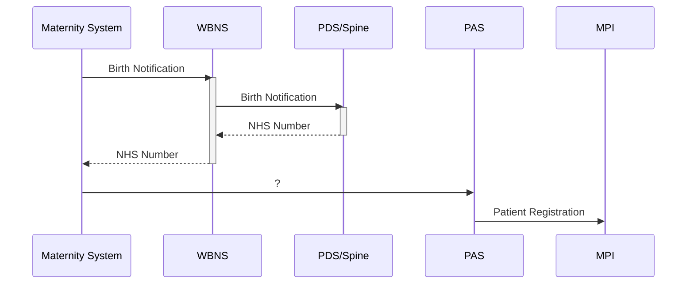
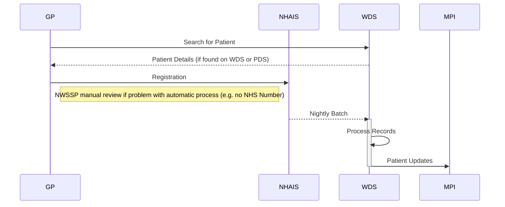
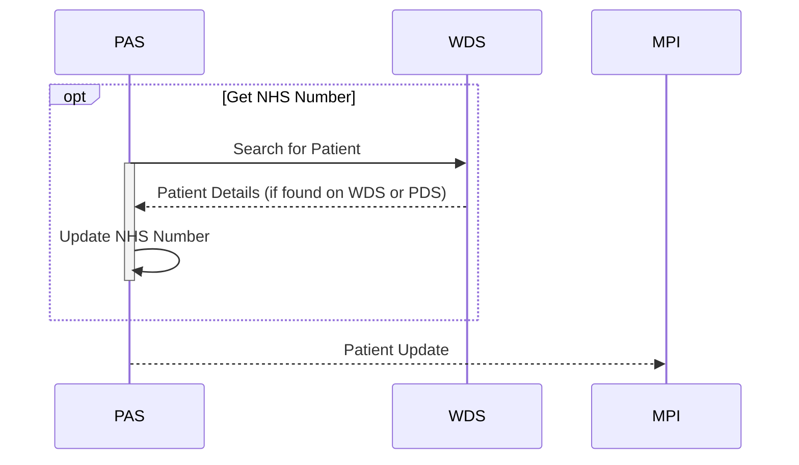

## Introduction
This provides a very brief overview of patient demographics data in NHS Wales. The first section describes the two key services, MPI and WDS, and where their data originates.
The second section outlines the scenarios where records will be created.

### Key Systems
#### MPI
The Master Patient Index (MPI) unites records from various patient administration systems to create a unified/composite view of each patient, matching records using a scoring algorithm (comparing date of birth, name, surname, etc.).
Systems can notify the MPI of changes to their locally held record and the MPI will notify systems of changes to the composite view.

A few things to note:
 - The matching process is automated and so not correct 100% of the time
 - Published changes to the composite view can be ignored (e.g. systems often ignore updates originating from another health board)

#### WDS
The Welsh Demographic Service (WDS) maintains a list of all patients registered at Welsh GPs. The MPI uses WDS as its definitive source of NHS Numbers for patients.
A few things to note:
 - The source of data for WDS is a nightly extract from NHAIS, which should be consistent with PDS.
 - WDS reflects data as on GP Systems the previous day, as they are required to stay in sync with NHAIS (and are the primary source of updates for it)
 - The WDS patient search API will also make background calls to PDS if the patient is not found in WDS.
 - WDS publishes data to MPI but does not accept updates, it's sole source of information is NHAIS

#### Acronym Buster

|Acronym  | Definition                                              |
|---------|---------------------------------------------------------|
|GP       | GP Patient Administration Systems (used in GP practices)|
|MPI      | Master Patient Index                                    |
|NHAIS    | National Health Application and Infrastructure Services |
|PAS      | Patient Administration Systems (used in hospitals)      |
|PDS      | Personal Demographics Service                           |
|WDS      | Welsh Demographics Service                              |
|WBNS     | Welsh Birth Notifcation Service                         |

### Scenarios - Creating a Patient Record

#### Newborn Child
A child is registred on a maternity system which will call WBNS to get an NHS Number, note that
- a record **will** be created in MPI (via the PAS).
- a record **will** be created in PDS (via WBNS)
- a record **will not** be created in WDS (but the WDS API does a background search against PDS anyway)
- the details of the mother in the birth notification will have been retrieved using the WDS API

#### New Patient GP Registration

A patient is registered using a GP System which then updates NHAIS, which is the source of information for WDS.
NHS Wales Shared Services will manually review records that can't be processed automatically, e.g. when no NHS Number could be found (i.e. not on WDS or PDS)
and can allocate a new NHS Number to the patient.
NHAIS is also a source of updates for GP Systems (e.g. changes to patient details or registration at a different GP surgery)

##### Relevant Documents about GP Registration
 - [NHAIS Developer Guides](https://digital.nhs.uk/services/nhais/nhais-developer-document-library)
 - [MESH Developer Guides - used to connect to NHAIS](https://digital.nhs.uk/services/message-exchange-for-social-care-and-health-mesh)
 - [Shared Services Guide to Registering Patients](http://www.primarycareservices.wales.nhs.uk/sitesplus/documents/1150/GOOD%20PRACTICE%20GUIDE%20-%20Final%20Feb16.pdf)

#### New Patient Hospital Registration

A patient is registered using a Patient Administration System which will then notify MPI for linkage to patient records in other systems.
If the PAS has access to the WDS API, it can be used to search for the patient and get the correct NHS Number

