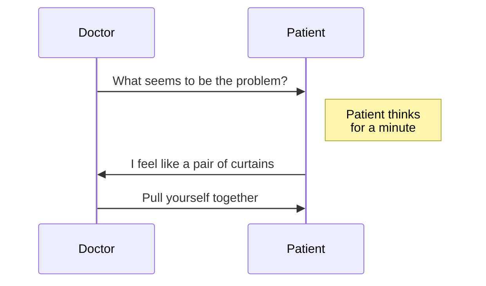
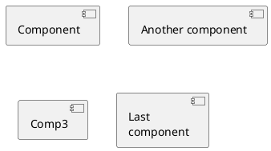

These documentation pages are aimed at anybody designing, developing and testing applications that will integrate with NHS Wales systems and data.

They are curated by NHS Wales Informatics Service as part of the [Digital Health Ecosystem](https://digitalhealth.wales/dhew) project, but anybody is free 
to contribute or suggest changes, all you need is a GitHub account, and it's as easy as clicking on the **Edit Me** link at the top of any documentation page. 

The site is published using [GitHub pages](https://pages.github.com/) and the pages are written in Markdown. This makes it really easy to add diagrams with a code block of [Mermaid JS](https://mermaid-js.github.io/mermaid/#/) or [Plant UML](https://plantuml.com/).

Here's an example of a Mermaid JS sequence diagram - you can use the [Mermaid Live Editor](https://mermaid-js.github.io/mermaid-live-editor) to check your syntax

Here's an example of Plant UML Component Diagram - you can use the [Plant UML online editor](http://www.plantuml.com/plantuml/uml/SyfFKj2rKt3CoKnELR1Io4ZDoSa70000) to check your syntax 

